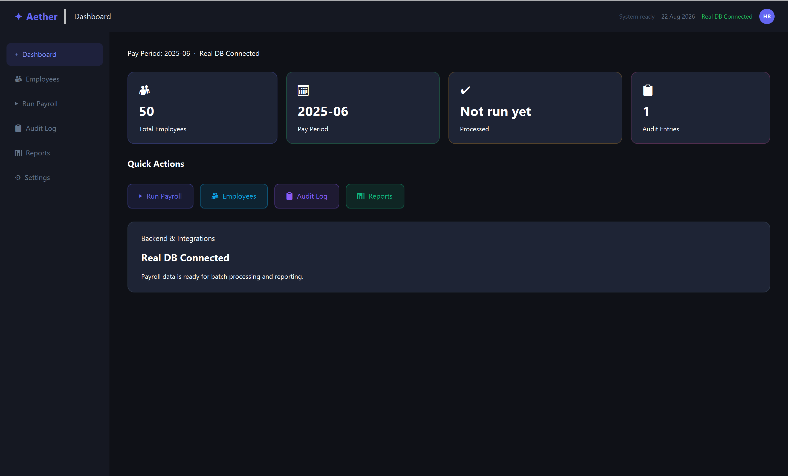
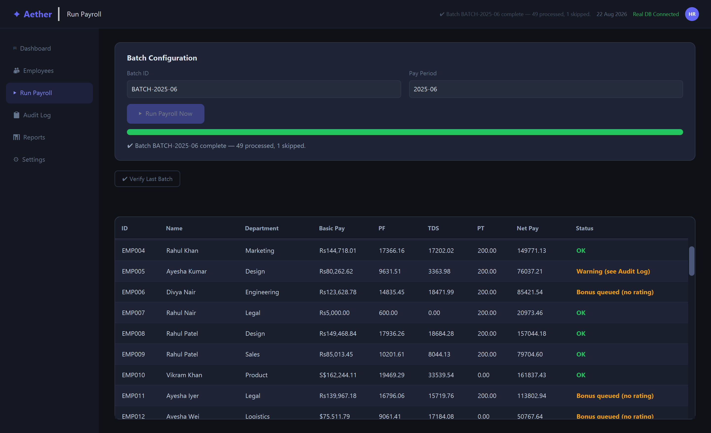
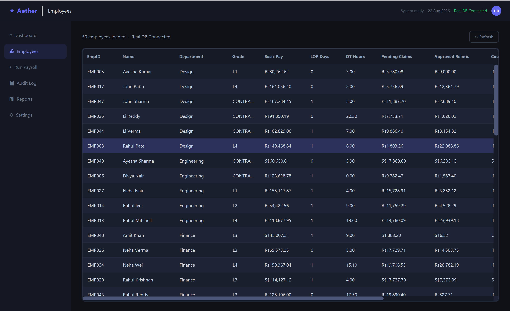
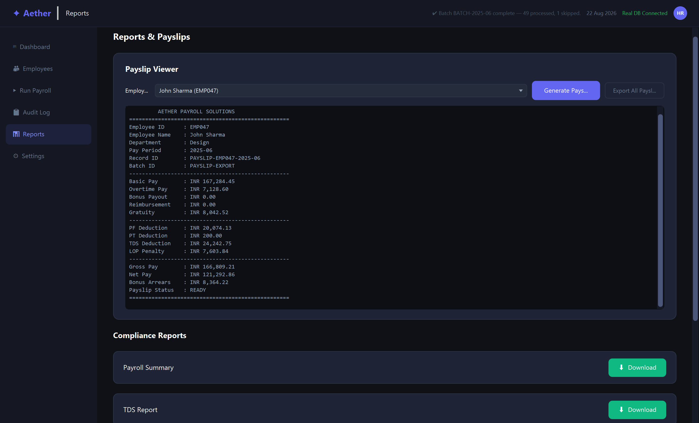
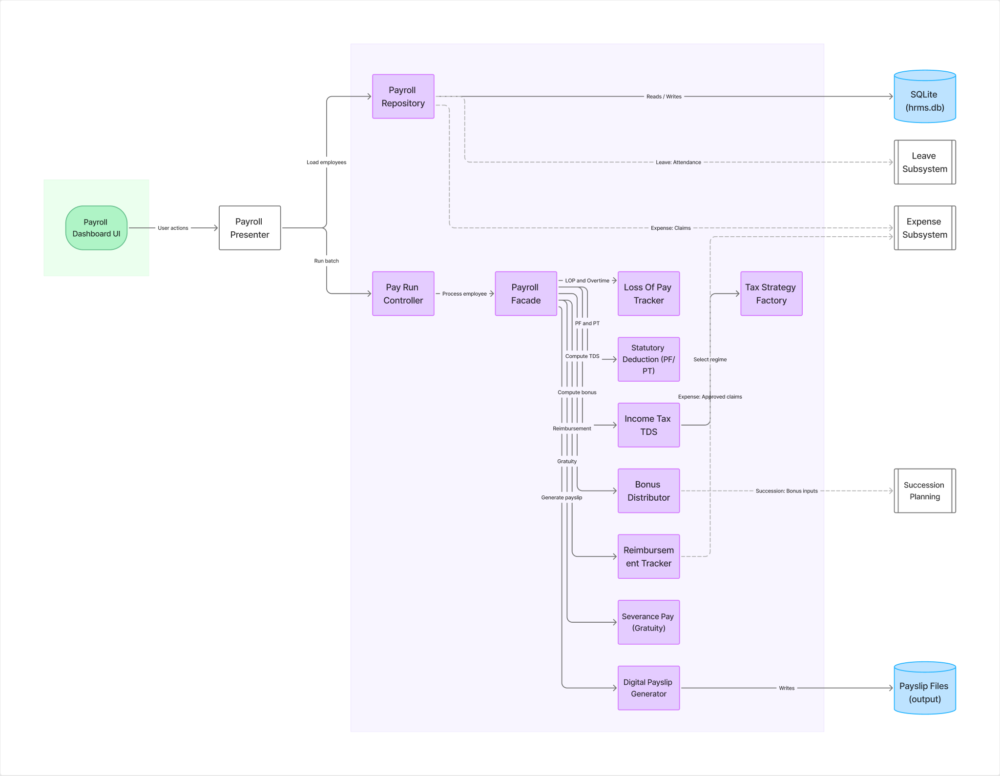

# Aether — Payroll Management System


A JavaFX desktop **payroll engine** for an HR Management System (HRMS), built as a 6th-semester
Object-Oriented Analysis & Design (OOAD) project. It computes salaries, statutory deductions,
taxes, bonuses, reimbursements and gratuity for a batch of employees, generates digital payslips,
and integrates with three sibling HRMS subsystems (Succession Planning, Expense, and Leave).

The application code lives under [`payroll-system/`](payroll-system).

<p align="center">
  
</p>
<p align="center"><sub>Add a short screen recording as <code>docs/images/demo.gif</code> to show a batch run end-to-end.</sub></p>

---

## Screenshots

> Drop screenshots into [`docs/images/`](docs/images) using the filenames below and they'll render here.

| Dashboard | Run Payroll |
|:---:|:---:|
|  |  |
| **Employees** | **Reports & Payslips** |
|  |  |

---

## Architecture

The system is layered and pattern-driven — appropriate for an OOAD deliverable. The UI never
touches business logic; everything flows through a presenter to a facade-orchestrated service layer,
backed by a repository over SQLite, with three sibling HRMS subsystems integrated on the right.

<p align="center">
  
</p>

<p align="center"><sub>Explore / edit the live diagram in <a href="https://www.figma.com/board/X53mhZ8iOATys24RcougeV">Figma (FigJam)</a>.</sub></p>

**In short:** the JavaFX UI talks only to the **Presenter** (MVP), which drives the **Repository**
(reads employees / writes results to SQLite) and the **Pay Run Controller**. The controller hands
each employee to the **Payroll Facade**, which fans out to seven domain services — LOP/overtime,
statutory PF/PT, TDS (via the **Tax Strategy Factory**), bonus, reimbursement, gratuity, and payslip
generation. Dotted edges are the external integrations: **Succession Planning** (bonus inputs),
**Expense** (approved claims), and **Leave** (attendance/overtime).

### Design patterns

| Pattern | Where | Purpose |
|---|---|---|
| **Facade** | [`PayrollFacade`](payroll-system/src/main/java/com/payroll/system/service/PayrollFacade.java) | One `processEmployee()` call orchestrates all 7 sub-services. |
| **Strategy** | [`TaxStrategy`](payroll-system/src/main/java/com/payroll/system/pattern/TaxStrategy.java) | Interchangeable tax regimes: India Old/New, US Federal, Singapore. |
| **Factory** | [`TaxStrategyFactory`](payroll-system/src/main/java/com/payroll/system/pattern/TaxStrategyFactory.java), [`PayrollSystemFactory`](payroll-system/src/main/java/com/payroll/system/service/PayrollSystemFactory.java) | Selects the tax strategy; assembles a fully wired facade. |
| **Builder** | [`Employee.Builder`](payroll-system/src/main/java/com/payroll/system/model/Employee.java) | Builds an immutable employee from ~20 fields; rejects invalid ones. |
| **MVP** | [`PayrollPresenterImpl`](payroll-system/src/main/java/com/payroll/system/presenter/PayrollPresenterImpl.java) | Maps DB data to ViewModels so the UI holds no business logic. |
| **Repository** | [`PayrollRepositoryImpl`](payroll-system/src/main/java/com/payroll/system/repository/PayrollRepositoryImpl.java) | Data access over SQLite; a `MockPayrollRepository` backs tests. |

### How a pay run works

1. The presenter loads all **active** employee IDs and their data packages from SQLite.
2. `PayRunController.executeBatchPayroll()` validates the pay period (rejects blank/duplicate
   periods), simulates attendance-fetch retries, then loops over employees.
3. For each employee the facade computes LOP penalty, overtime, PF/PT, TDS (via the tax strategy),
   bonus (enriched by the Succession subsystem), reimbursement (from the Expense subsystem), and
   gratuity — then `PayrollRecord.calculateTotals()` folds these into gross and net pay.
4. **Graceful degradation** — errors are handled per-employee rather than failing the whole batch:
   - Missing work state → record **flagged for HR review**.
   - Negative net pay → converted to **arrears**, net clamped to 0, flagged.
   - Payslip generation failure → logged as a warning; the run continues.
5. Results are persisted back to `payroll_results`, and a payslip text file is written to
   `output/payslips/`.

---

## Tech stack

- **Java 21** (compiles targeting release 21)
- **JavaFX 21** — desktop UI
- **SQLite** via `sqlite-jdbc` — data store (`hrms.db`)
- **Maven** — build
- **JUnit 5** — tests

Main class: `com.payroll.system.PayrollDashboardUI`.

---

## Project layout

```
payroll-system/
├── pom.xml
├── hrms.db                     # SQLite database (checked in)
├── lib/                        # system-scoped dependency JARs
│   ├── hrms-database.jar       # DB repositories + subsystem DTOs
│   └── succession-planning-*.jar
├── output/payslips/            # generated payslip files
└── src/
    ├── main/java/com/
    │   ├── hrms/…              # shared DTOs / service contracts
    │   └── payroll/system/
    │       ├── model/          # Employee, PayrollRecord, SalaryGradeStructure
    │       ├── pattern/        # TaxStrategy (+ Factory)
    │       ├── service/        # Facade, controller, 7 domain services, factories
    │       ├── presenter/      # MVP presenter + ViewModels
    │       ├── repository/     # SQLite + mock repositories
    │       ├── exception/      # PayrollException hierarchy
    │       ├── util/           # AuditLogger, DatabaseConfig
    │       └── PayrollDashboardUI.java
    └── test/java/…            # AppTest (JUnit 5)
```

---

## Build & run

**Prerequisites:** JDK 21+ and Maven 3.9+.

```bash
# 1. Clone
git clone https://github.com/Nihal180804/Aether---Payroll-Management-System.git
cd Aether---Payroll-Management-System/payroll-system

# 2. Build & test
mvn compile          # build
mvn test             # run JUnit 5 tests  (3 tests, all passing)

# 3. Launch the JavaFX dashboard
mvn javafx:run
```

The JavaFX Maven plugin is preconfigured with the main class, so `mvn javafx:run` launches the UI
without extra module-path flags. A desktop display is required (it won't run headless/over SSH).

> [!NOTE]
> **Subsystem integration adapters.** The source depends on
> `com.pesu.expensesubsystem.integration.*` and `com.pesu.leavesubsystem.integration.*`, but the
> `lib/hrms-database.jar` checked into the repo is an older build that ships only
> `com.pesu.expensesubsystem.enums` / `.entity` and no `leavesubsystem` package at all. To keep the
> project buildable, these integration classes are provided as source under
> [`src/main/java/com/pesu/`](payroll-system/src/main/java/com/pesu):
> `ApprovedClaimDTO`, `ExpenseDataProvider`, `ExpenseDataProviderImpl`, `LeaveDetailsDTO`, and
> `LeaveDataProviderImpl`. They are DB-backed adapters over the shared `hrms.db` (approved
> `expense_claims` and approved `overtime_records`) that degrade gracefully to attendance-of-record.
> If a newer `hrms-database.jar` that already contains these `integration` packages is dropped into
> `lib/`, delete the source copies to avoid duplicate classes.

---

## Notes & known rough edges

- **Reflection wiring** — [`PayrollSystemFactory`](payroll-system/src/main/java/com/payroll/system/service/PayrollSystemFactory.java)
  uses `setAccessible(true)` to inject private fields into the succession-planning services, because
  that JAR exposes no constructors/setters. Fragile if the library changes.
- **Hardcoded pay period** — `"2025-06"` appears in
  [`PayrollServiceImpl`](payroll-system/src/main/java/com/payroll/system/service/PayrollServiceImpl.java).
- **Gratuity semantics** — `SeverancePay.calculateGratuity()` divides the total gratuity by
  `yearsOfService * 12` to produce a monthly figure; worth confirming this is intended.
- **`Services.java`** packs all 7 package-private domain-service classes into a single file after an
  empty `Services` class — keeps them encapsulated in the `service` package, but is unusual.
- **Committed binaries** — `hrms.db`, `hrms_backup.db`, and the `lib/` JARs are checked in even though
  `.gitignore` excludes `*.db` (they were likely force-added).
